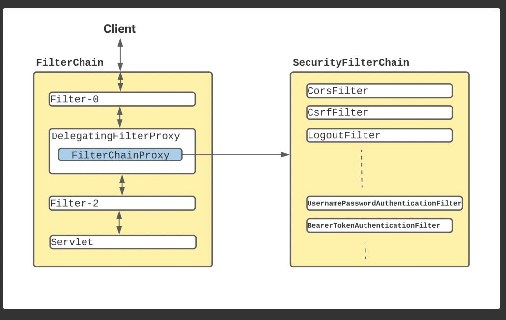
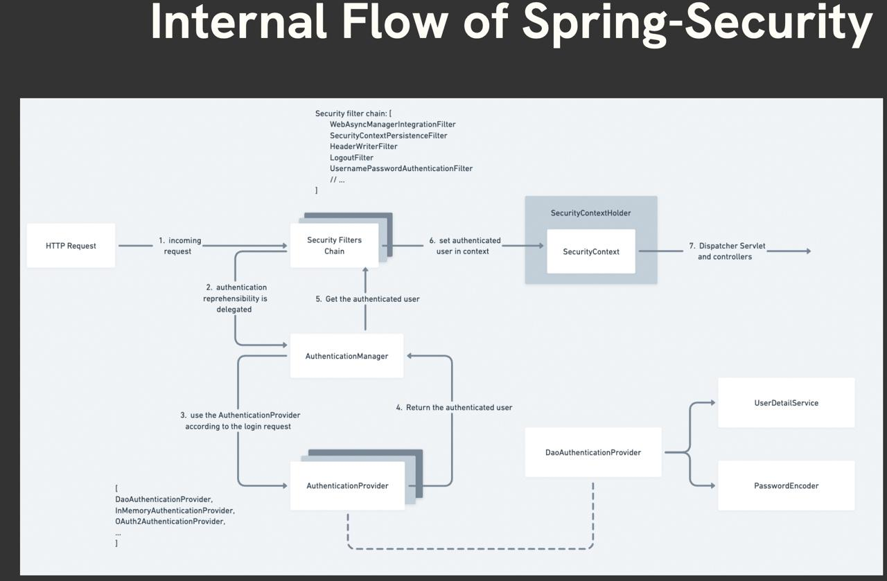
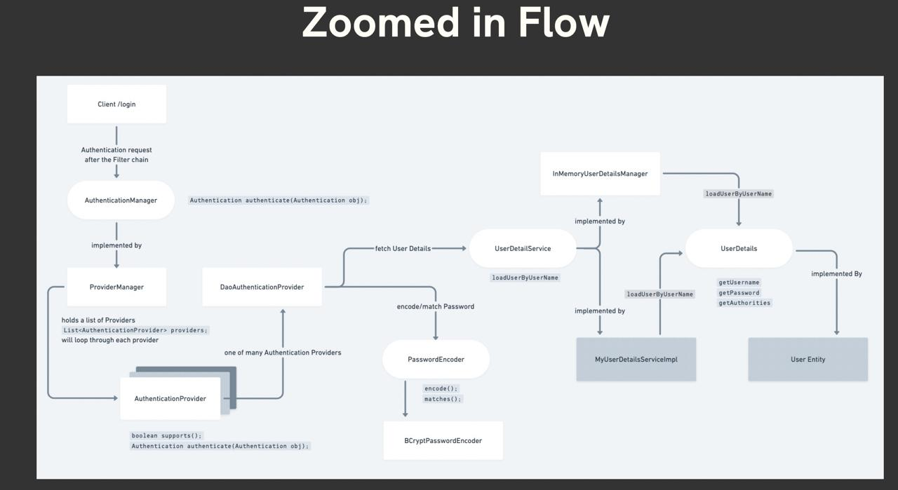
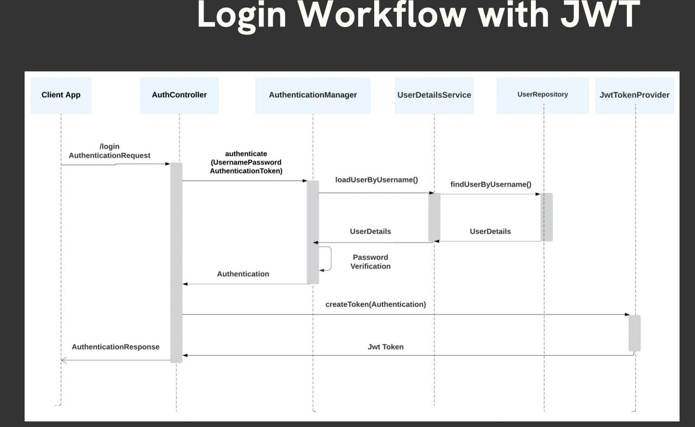
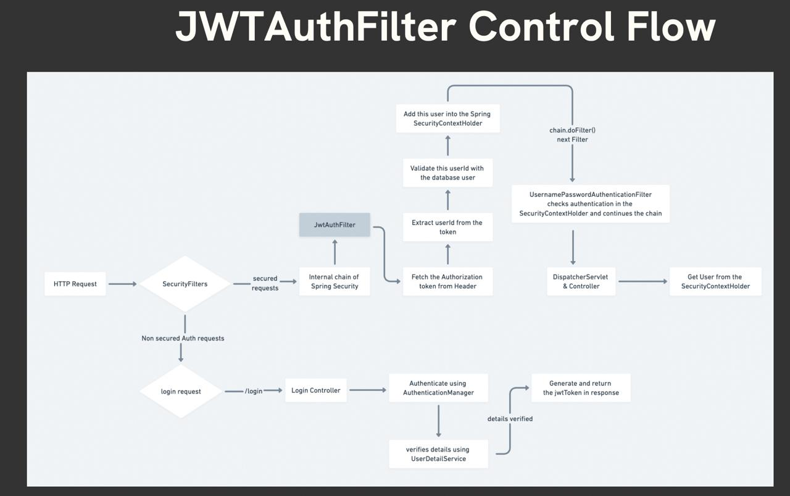
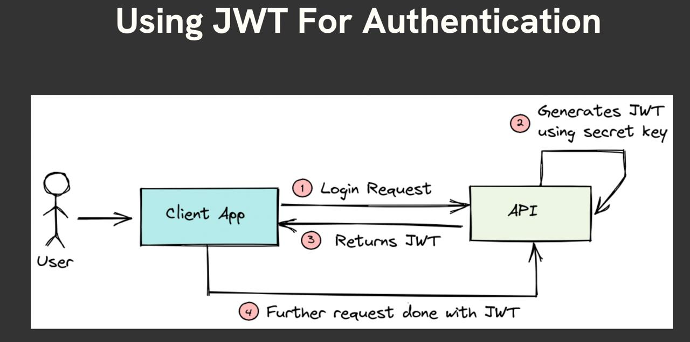
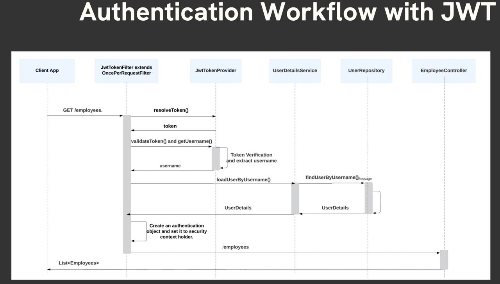

# Spring Security

This project covers the basic SpringBoot appliaction having the below files:

1. Added a spring security feature to protect user from csrf and enable login and logout by default
2. Self configure login and logout 
3. Created a User Entity which implements UserDetails(spring security) to grand authority, getPassword and username.
4. Created a repo parallel to it to store or fetch data from db (UserRepository).
5. Created a UserService to load User By UserName else throws an runtime exception(ResourceNotFoundException).
6. Created a FilterChain in WebSecureConfig to implements all the lists of filters in ongoing current request.
   
7. Used request Machers for endpoints for -public routings like (/posts. /public/**) we are permitting them all.
8. Autheniticated other requests than above mention public routes.
9. Used formLogin() that loads the FormLoginConfigure class that loads login page to authenticate based on username and password.
10. We have use csrf protection and for now we have remove session based authentification and made the session STATELESS.
11. All the above feature added in class WebSecureConfig.
12. Define the jwt secret key in application.properties and used it in JwtService class as a Secret Key (cryptographic key used for symmetric encryption algorithms (e.g., AES, DES, HMAC) ) which is further build in token generation where it is used for signing for token creation.
13. Created a signUp flow in the user service where we are encripting the password using the passwordEncoder which we have created the bean in WebSecureConfig and whatever password is there we are saving it in db is in encripted. 
14. For the login flow we have created LoginDto for username and password, and inside a controller returning a token ResponseEntity.ok(token).
15. For authenticating the user we are using AuthenticationManager as a bean first inside WebSecureConfig and use the AuthenticationManager in the service(UserService).


16. Basically AuthenticationManager is an inferace and we are using UsernamePasswordAuthenticationToken class for authenticating.
17. We have created a cookie too inside our login controller.
    
18. We have created a JwtAuthFiler and inside we have SecurityContextHolder which hold the context after login which is basically our customise Security filter chain.
    
19. And we have use the JwtAuthFilter inside our default filter inside our WebSecureConfig by adding addFilterBefore. 
20. To handle handleAuthenticationException we have declare it in GlobalExceptionHandler
    
    


## API Reference

#### Create a user and saved in db

```http
  POST http://127.0.0.1:8080/auth/signup
```

| Parameter | Type     | Description                          |Return|
| :-------- | :------- |:-------------------------------------|:---------|
| `jSON body` | `string` | **Required** email, password and name|userDto Cointating email and name|
#### Login user if signup already happened

```http
  GET http://127.0.0.1:8080/auth/login
```

| Parameter | Type     | Description                       |Return|
| :-------- | :------- | :-------------------------------- |:-------|
| null      |          | **Required**. Fetch All the Posts |Token |


#### Get all Posts based on postId

```http
  GET http://127.0.0.1:8080/posts/{postId}
```
| Parameter | Type     | Description                                                                         |
| :-------- | :------- |:------------------------------------------------------------------------------------|
| postId    |Integer   | **Required**. Fetch Post based on the PostId and required a Bearer token from login |


## Authors

- [@sushantanandy](https://www.linkedin.com/in/sushantanandy/)